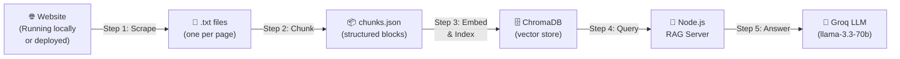
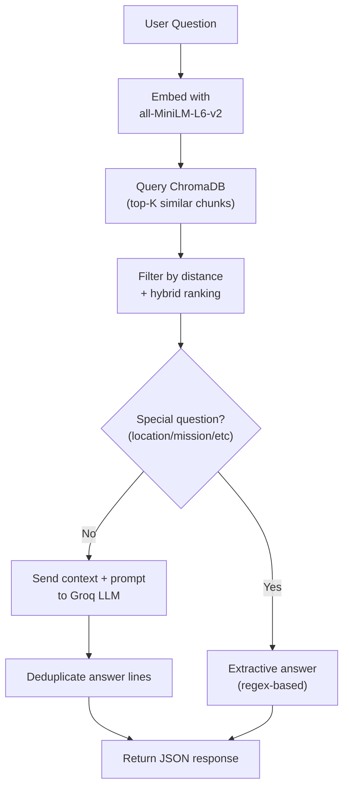

# RAG Chatbot Development Roadmap

A step-by-step guide to building a **Retrieval-Augmented Generation (RAG) chatbot** for any website.
This roadmap is based on the MANO Projects chatbot we built together — adapt the names, URLs, and prompts for your new website.

---

## Architecture Overview



| Layer | Technology | Purpose |
|-------|-----------|---------|
| Scraper | Python + Playwright | Renders JS pages, extracts text per section |
| Chunker | Python (script or Jupyter) | Splits raw text into semantically meaningful blocks |
| Embedder/Indexer | Python + `sentence-transformers` + ChromaDB | Converts chunks into vectors and stores them |
| Server | Node.js + Express | Serves the `/chat` API endpoint |
| Retrieval | `@xenova/transformers` + ChromaDB (npm) | Embeds user questions and queries the vector DB |
| LLM | Groq SDK (`llama-3.3-70b-versatile`) | Generates natural-language answers from context |

---

## Step 0 — Project Setup

### Folder Structure
```
your-project/
├── backend/
│   ├── .env                  # API keys & config
│   ├── server.js             # Express API server
│   ├── rag.js                # Core RAG logic
│   ├── index_knowledge.py    # Embeds chunks → ChromaDB
│   ├── chunk_data.py         # Chunks .txt files → chunks.json
│   ├── chroma_data/          # ChromaDB persistent storage (auto-created)
│   ├── package.json          # Node.js dependencies
│   └── requirements.txt      # Python dependencies
├── scripts/
│   └── scrape_website.py     # Playwright web scraper
├── knowledge_base/
│   ├── pages/                # Raw scraped .txt files (one per page)
│   └── chunks.json           # Final chunked data (auto-generated)
└── test_chat.py              # Quick test script
```

### Install Dependencies

**Node.js (backend server):**
```bash
cd backend
npm init -y
npm install express cors dotenv chromadb @xenova/transformers groq-sdk
```

**Python (data pipeline):**
```bash
pip install playwright chromadb sentence-transformers
python -m playwright install chromium
```

### Environment Variables ([backend/.env](file:///d:/Users/Danish/Desktop/Projects/MANO-Website/backend/.env))
```env
GROQ_API_KEY=your_groq_api_key_here    # Get free key at console.groq.com
GROQ_MODEL=llama-3.3-70b-versatile
PORT=8001
CHROMA_URL=http://localhost:8000
ALLOWED_ORIGINS=http://localhost:5173   # Your frontend URL
```

> [!TIP]
> Groq offers a generous free tier with fast inference. Get your API key at [console.groq.com](https://console.groq.com).

---

## Step 1 — Scrape the Website

**Goal:** Extract rendered text from every page of your website into individual [.txt](file:///d:/Users/Danish/Desktop/Projects/MANO-Website/backend/requirements.txt) files.

### Why Playwright?
Standard HTML scrapers miss content rendered by JavaScript (React, Vue, etc.). Playwright runs a real browser, scrolls the page, waits for lazy-loaded content, and then extracts text.

### What to Do

1. **List all your pages** in the `PAGES` array inside [scrape_website.py](file:///d:/Users/Danish/Desktop/Projects/MANO-Website/scripts/scrape_website.py):
```python
BASE_URL = "http://localhost:5173"  # or your live domain

PAGES = [
    ("",              "landing_page"),
    ("/about-us",     "about_us"),
    ("/services",     "services_overview"),
    ("/contact",      "contact"),
    # ... add every page you want the chatbot to know about
]
```

2. **Run the scraper** (your vite/frontend dev server must be running first):
```bash
python scripts/scrape_website.py
```

3. **Output:** One [.txt](file:///d:/Users/Danish/Desktop/Projects/MANO-Website/backend/requirements.txt) file per page in `knowledge_base/pages/`, structured like:
```
PAGE: LANDING PAGE
URL: http://localhost:5173

============================================================
[ SECTION 1 ]
============================================================
Hero section text here...

============================================================
[ SECTION 2 ]
============================================================
About section text here...
```

> [!IMPORTANT]
> **Start your frontend dev server first** (`npm run dev`) before running the scraper. Playwright needs the site to be accessible.

### Key Scraper Features
- Removes `<nav>`, `<footer>`, `<script>`, `<style>` tags to reduce noise
- Splits page content by top-level `<section>` elements
- Scrolls to bottom to trigger lazy-loaded content
- Saves clean, section-delimited text

### Post-Scrape Checklist
- [ ] Verify each `.txt` file has meaningful content
- [ ] Check that contact info, addresses, and key data are captured
- [ ] Manually add any missing data (footer addresses, phone numbers) as a new section at the end of the relevant `.txt` file

---

## Step 2 — Chunk the Text

**Goal:** Split the raw `.txt` files into semantically coherent blocks and save them as `chunks.json`.

### What the Chunker Does
1. Reads each `.txt` file from `knowledge_base/pages/`
2. Splits on `===` delimiters (the section markers from the scraper)
3. Strips `[ SECTION N ]` headers
4. Filters out chunks that are too short (< 30 characters)
5. Produces a JSON array of structured chunk objects

### What to Do

Run the chunking script:
```bash
python backend/chunk_data.py
```

Or execute the Jupyter Notebook:
```bash
python -m jupyter nbconvert --execute --inplace backend/chunk_data.ipynb
```

### Output Format (`chunks.json`)
```json
[
  {
    "id": "chunk_0000",
    "page_name": "LANDING PAGE",
    "url": "http://localhost:5173",
    "source_file": "landing_page.txt",
    "section_num": 0,
    "content": "Welcome to Your Company — We provide..."
  },
  ...
]
```

### Tuning Tips

| Parameter | Default | Effect |
|-----------|---------|--------|
| Min chunk length | 30 chars | Lower = keeps short data like addresses; Higher = filters noise |
| Section delimiter | `={3,}` regex | Must match the pattern used by the scraper |

> [!WARNING]
> If important short text (like addresses or phone numbers) is missing from `chunks.json`, **lower the minimum chunk length** in the chunker script. This was a key lesson from our MANO build.

---

## Step 3 — Embed & Index into ChromaDB

**Goal:** Convert each text chunk into a vector embedding and store it in ChromaDB for fast similarity search.

### What the Indexer Does
1. Loads `chunks.json`
2. Uses `all-MiniLM-L6-v2` (local, free, no API key) to generate 384-dim embeddings
3. Upserts all chunks + metadata into a ChromaDB persistent collection

### What to Do

First, start ChromaDB server (separate terminal):
```bash
chroma run --path backend/chroma_data --port 8000
```

Then index:
```bash
python backend/index_knowledge.py
```

Expected output:
```
[INDEX] Loaded 133 chunks from: knowledge_base/chunks.json
[INDEX] Embedding 133 chunks...
[SUCCESS] 133 vectors are now stored in ChromaDB.
```

> [!NOTE]
> The **same embedding model** (`all-MiniLM-L6-v2`) must be used for both indexing (Python `sentence-transformers`) and querying (Node.js `@xenova/transformers`). If you change models, re-index everything.

---

## Step 4 — Build the RAG Server

**Goal:** Create a Node.js API server that takes a user question, retrieves relevant chunks, and feeds them to an LLM for a natural-language answer.

### Architecture of `rag.js`



### Key Components

#### System Prompt
Define a persona and strict rules:
```javascript
const SYSTEM_PROMPT = `You are an official assistant for [Your Company].

RULES:
- Answer ONLY using the context provided below.
- Provide PRECISE and DETAILED answers with exact figures, names, and dates.
- If the answer is not in the context, say:
  "I don't have that specific information. Please contact us directly."
- Never discuss unrelated topics.`;
```

#### Retrieval Parameters
| Parameter | Recommended | Description |
|-----------|------------|-------------|
| `topK` | 24 | Default number of chunks to retrieve |
| Distance threshold | 1.5–1.9 | Chunks beyond this are filtered as irrelevant |
| Hybrid semantic weight | 0.7 | Weight for embedding similarity |
| Hybrid keyword weight | 0.3 | Weight for keyword overlap |

#### Special Question Handlers
For critical questions where the LLM might hallucinate (e.g., addresses), add **extractive handlers** that use regex to pull exact data directly from the retrieved chunks:
```javascript
// Detect question type
const LOCATION_REGEX = /\b(where|location|address|office)\b/i;

// Extract exact answer with regex instead of LLM
function extractExactAddress(documents) {
    for (const doc of documents) {
        const match = doc.match(/Head Office Address:\s*\n?(.+)/i);
        if (match) return match[1].trim();
    }
    return "";
}
```

#### Rate-Limit Fallback
When the LLM API is rate-limited, fall back to an extractive answer from ranked chunks instead of showing an error:
```javascript
if (isRateLimited) {
    return buildExtractiveFallbackAnswer(question, relevant);
}
```

### `server.js` — Express API

Two routes:
| Route | Method | Purpose |
|-------|--------|---------|
| `/health` | GET | Liveness check + vector count |
| `/chat` | POST | Main chatbot — accepts `{ "question": "..." }` |

### What to Do
```bash
cd backend
node server.js
```

The server starts at `http://localhost:8001`.

---

## Step 5 — Test & Verify

### Quick Test Script (`test_chat.py`)
```python
import urllib.request, json

questions = [
    "What services do you offer?",
    "Where is your office located?",
    "When was the company established?",
]

for q in questions:
    data = json.dumps({'question': q}).encode()
    req = urllib.request.Request(
        'http://localhost:8001/chat',
        data=data,
        headers={'Content-Type': 'application/json'}
    )
    resp = json.loads(urllib.request.urlopen(req).read().decode())
    print(f"Q: {q}")
    print(f"A: {resp['answer']}")
    print(f"Sources: {resp['sources']}")
    print("-" * 60)
```

Run with:
```bash
python test_chat.py
```

### What to Check
- [ ] Does the answer include specific details (addresses, names, dates)?
- [ ] Are the source attributions correct?
- [ ] Does the "I don't know" fallback work for unrelated questions?
- [ ] Does the extractive fallback work when the LLM is rate-limited?

---

## Step 6 — Connect to Your Frontend

Add a chat widget to your React/Vue/HTML frontend that calls the API:

```javascript
async function askChatbot(question) {
    const res = await fetch('http://localhost:8001/chat', {
        method: 'POST',
        headers: { 'Content-Type': 'application/json' },
        body: JSON.stringify({ question }),
    });
    const data = await res.json();
    return data; // { answer: "...", sources: [...] }
}
```

> [!TIP]
> Update `ALLOWED_ORIGINS` in `.env` to match your frontend's URL to avoid CORS errors.

---

## Replication Checklist for a New Website

Use this checklist when applying this roadmap to a different website:

### Setup
- [ ] Create the folder structure (backend, scripts, knowledge_base)
- [ ] Install Node.js and Python dependencies
- [ ] Get a Groq API key and create `.env`

### Data Pipeline
- [ ] Update `PAGES` array in `scrape_website.py` with all your new website's routes
- [ ] Update `BASE_URL` to point to your new site
- [ ] Run the scraper: `python scripts/scrape_website.py`
- [ ] Verify `.txt` files in `knowledge_base/pages/`
- [ ] Manually add any missing critical data to the `.txt` files
- [ ] Run the chunker: `python backend/chunk_data.py`
- [ ] Verify `chunks.json` has all expected content
- [ ] Start ChromaDB: `chroma run --path backend/chroma_data --port 8000`
- [ ] Run the indexer: `python backend/index_knowledge.py`

### Server
- [ ] Update the `SYSTEM_PROMPT` in `rag.js` with your new company name and persona
- [ ] Update any extractive handlers (address regex, etc.) for your new data
- [ ] Start the server: `node backend/server.js`
- [ ] Run `test_chat.py` with questions relevant to your new site
- [ ] Verify answers, sources, and fallback behavior

### Frontend
- [ ] Connect your frontend chat UI to `POST /chat`
- [ ] Update CORS origins in `.env`

---

## Lessons Learned & Common Pitfalls

| Issue | Root Cause | Fix |
|-------|-----------|-----|
| LLM says "address not available" | Chunk was filtered out (too short) | Lower min chunk length to 30 chars |
| Specific data missing from answers | `topK` too low, relevant chunk not retrieved | Increase `topK` to 24+ |
| Scraper misses JS-rendered content | Using requests/BeautifulSoup | Use Playwright with headless browser |
| Embeddings mismatch between index and query | Different models used in Python vs Node.js | Use `all-MiniLM-L6-v2` in both |
| API 429 rate limit errors | Gemini free tier too restrictive | Switch to Groq (generous free tier) |
| `.txt` file missing last section | No closing `====` delimiter | Add `====` delimiter after last section |
| Port conflict on startup | Stale Node.js process | `taskkill /F /IM node.exe` then restart |

---

## Full Pipeline Command Sequence

```bash
# 1. Start your frontend dev server (separate terminal)
cd your-project && npm run dev

# 2. Scrape all pages
python scripts/scrape_website.py

# 3. Chunk the scraped text
python backend/chunk_data.py

# 4. Start ChromaDB (separate terminal)
chroma run --path backend/chroma_data --port 8000

# 5. Index chunks into ChromaDB
python backend/index_knowledge.py

# 6. Start the RAG server
node backend/server.js

# 7. Test
python test_chat.py
```

> [!IMPORTANT]
> Every time you update the website content:
> 1. Re-scrape → 2. Re-chunk → 3. Re-index → 4. Restart server
